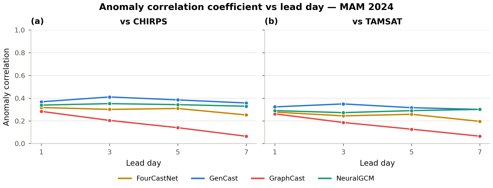
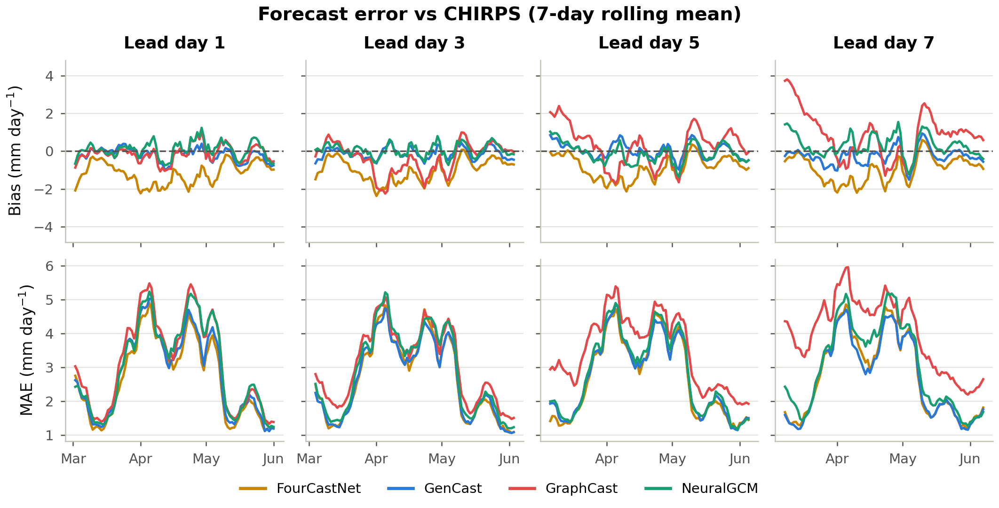
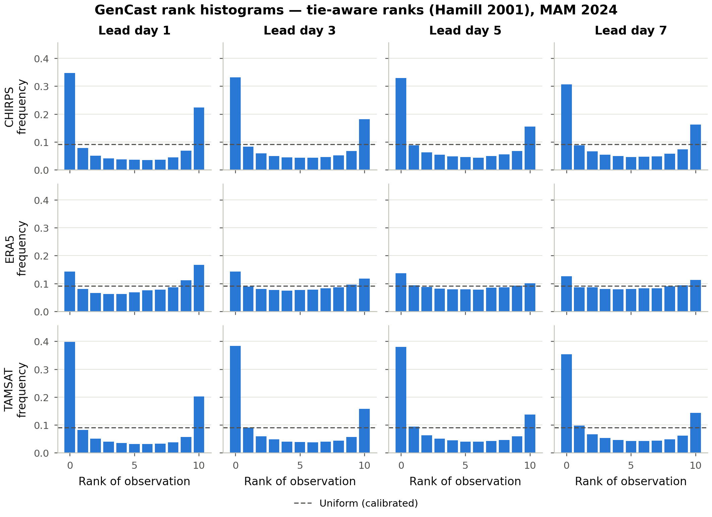

# Key Findings

The five headline results of the MAM 2024 benchmark, each with its primary
supporting figure. See the [Results](results/index.md) section for the full
figure set, tables and per-metric discussion.

## 1. GenCast is the strongest overall

It has the lowest CRPS (~2.0 mm day⁻¹), the highest and most stable anomaly
correlation, the best-calibrated exceedance probabilities, and is the **only
model that beats climatology**, over the equatorial belt.

{ loading=lazy }

Blue = beats the CHIRPS climatology baseline (CRPSS > 0). GenCast holds a blue
equatorial band out to lead day 7; GraphCast and FourCastNet are mostly red
(worse than climatology). Details: [Skill vs Climatology](results/skill-vs-climatology.md).

## 2. All models have limited deterministic skill

Anomaly correlation stays **below the 0.6 "useful-skill" guide at every lead**,
and degrades with lead time for two of the three models — these are genuinely
hard, convection-dominated rains.

{ loading=lazy }

No model reaches the ACC = 0.6 guide at any lead. GenCast (≈0.36–0.41) is
highest and flattest; GraphCast degrades fastest, from ≈0.28 to ≈0.09 by day 7.
Details: [Deterministic Skill](results/deterministic-skill.md).

## 3. Distinct, stable bias signatures

**FourCastNet is systematically dry** (≈ −1.2 mm day⁻¹); **GraphCast drifts
wet** at longer leads (+0.84 mm day⁻¹ by day 7); **GenCast is nearly unbiased**
in the domain mean.

{ loading=lazy }

Seven-day rolling bias (top) and MAE (bottom) vs valid date, one column per
lead day. The three models keep their sign and character throughout the
season. Details: [Deterministic Skill](results/deterministic-skill.md).

## 4. GenCast is under-dispersive (overconfident)

Spread–skill ratio rises from ~0.5 (day 1) toward ~0.8 (days 5–7) but never
reaches the calibrated SSR = 1 line, and rank histograms are U-shaped — the
ensemble is too narrow, especially at short lead.

{ loading=lazy }

Left: SSR vs lead, with the under-dispersive region (SSR < 1) shaded. Right:
the two ingredients (RMSE, spread) plotted separately. Details:
[Probabilistic Calibration](results/probabilistic-calibration.md).

## 5. Results are observation-sensitive

Skill and calibration shift visibly across CHIRPS / ERA5 / TAMSAT, underscoring
observational uncertainty over this data-sparse region.

{ loading=lazy }

Against CHIRPS and TAMSAT the rank histograms are sharply U-shaped (rank 0 ≈
0.47–0.55); against ERA5 they are far flatter (rank 0 ≈ 0.19) — GenCast looks
much better calibrated against the reanalysis it was partly trained near than
against the independent gauge–satellite products. Details:
[Probabilistic Calibration](results/probabilistic-calibration.md).
