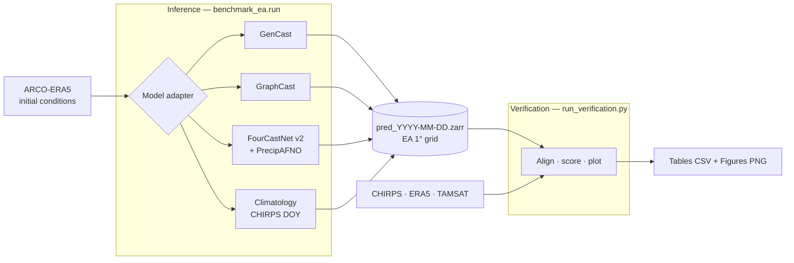

# Methodology

How the benchmark is built (the pipeline) and what exactly it measures (the
experimental setup) — the two halves of "can I trust this result."

## System pipeline

The benchmark is a single reproducible pipeline built on xarray, Zarr, xESMF and
the properscoring/scores libraries. It has two decoupled stages — **inference**
(produce forecasts) and **verification** (score and plot them) — sharing one
canonical on-disk format.



### Canonical forecast format

Every model — deterministic or ensemble — writes **one Zarr store per
initialization date** in an identical layout, so verification code is the same
for all of them:

```
total_precipitation : float32  (init_time, sample, lead_day, lat, lon)   mm day⁻¹
```

Deterministic models (GraphCast, FourCastNet) are stored as single-member
ensembles (`sample = 1`), so their probabilistic scores reduce to the correct
deterministic limits (e.g. CRPS → MAE). Precipitation is regridded and subset to
the common **1° East Africa grid** before saving.

### Single inference entry point

All inference is driven by one configurable command, `benchmark_ea.run`
(wrapped by `run_inference.sh`, which activates the conda environment):

```bash
# Precipitation only (default), all models, full window
./run_inference.sh --models gencast graphcast fourcastnet climatology \
    --start 2024-03-01 --end 2024-05-31 --lead-days 1 3 5 7
```

Key flags: `--models · --start · --end · --lead-days · --n-members ·
--output-dir · --overwrite`. Each initialization is written to its own file, so
runs are **resumable** (complete files are skipped) and reproducible.

The same runner can also persist **every model variable** (not just rainfall),
regridded to the EA grid, via `--save-variables all`; see
[Reproducibility](reproducibility.md) for the full flag reference. A multi-GPU
launcher, `run_inference_parallel.sh`, runs one model per GPU with the same
options via environment variables.

### Verification

`run_verification.py` loads the prediction stores and the three observational
references, aligns each forecast with the observation valid at *init + lead*,
and computes the full metric catalogue (below). It writes CSV tables plus all
figures shown in the Results section, and reads only `total_precipitation`, so
it works identically on precip-only and all-variable prediction stores.

The climatology baseline, when present, is loaded automatically and used as the
reference for the **CRPS skill score** (CRPSS).

## Experimental setup

### Study domain and evaluation period

We evaluate daily rainfall forecasts over East Africa on a common regular grid
spanning **12°S–15°N and 28°E–52°E at 1° resolution** (28 × 25 = 700 grid
cells), matching the native output resolution of the graph-based models.
Verification is restricted to **land** using a mask derived from the Natural
Earth 50 m land polygons (~512 cells); ocean and large inland-lake cells are
excluded throughout.

For regional analysis the domain is further subset into the seven flood-season
countries of the Greater Horn of Africa — **Kenya, Ethiopia, Tanzania, Somalia,
Uganda, Rwanda and Burundi** — and into zonal latitude bands. All spatially
aggregated statistics use **cos(latitude) area weights** so regional means are
not biased toward higher latitudes.

The experiments target the **March–April–May (MAM) 2024 long rains**. Each model
is initialized daily over the full season — **92 initializations from 1 March to
31 May 2024** — and verified at lead times of **1, 3, 5 and 7 days**. A forecast
initialized at 00 UTC on date *t* is compared against observations valid on
*t + ℓ*, so verified valid dates extend through 7 June 2024.

### Models

Three state-of-the-art ML forecast systems are benchmarked against a
climatological baseline. All learned models are initialized from ERA5 analyses
(public ARCO-ERA5 archive); their precipitation is regridded and subset to the
common 1° domain and expressed in mm day⁻¹.

| System | Type | Ensemble | Precipitation |
|---|---|---|---|
| **GenCast** (GenCast-Mini) | diffusion generative | 10 members | native, summed 12-hourly |
| **GraphCast** (GraphCast-small) | deterministic GNN | 1 (deterministic) | native, summed 6-hourly |
| **FourCastNet v2** + PrecipitationAFNO | deterministic SFNO | 1 (deterministic) | diagnostic from state |
| **Climatology** | reference baseline | 21 years | CHIRPS day-of-year, 2000–2020 |

- **GenCast** — diffusion-based generative ensemble (GenCast-Mini checkpoint),
  10 members per initialization, native 12-hourly increments summed to daily.
- **GraphCast** — deterministic graph neural network (GraphCast-small, ERA5
  1979–2015, 1°, 13 pressure levels), run autoregressively.
- **FourCastNet v2** — deterministic spherical-Fourier neural operator; rainfall
  via the separate PrecipitationAFNO diagnostic (6-hourly accumulation), run
  through NVIDIA earth2mip.

GraphCast and FourCastNet are deterministic, stored as single-member ensembles;
their probabilistic scores reduce to the corresponding deterministic limits
(e.g. CRPS → MAE).

The **climatological baseline** is built from the day-of-year distribution of
CHIRPS over the reference period **2000–2020**, giving a 21-member ensemble that
is strictly out-of-sample with respect to 2024.

### Reference observations

To ensure conclusions are not artifacts of a single product, every model is
verified against **three independent rainfall references**, each conservatively
regridded (area-weighted xESMF) to the common 1° grid:

| Product | Native res. | Type |
|---|---|---|
| **CHIRPS v2.0** (primary) | 0.05° | blended gauge–satellite (UCSB) |
| **ERA5** total precipitation | 0.25° | reanalysis (hourly → daily) |
| **TAMSAT v3.1** | 0.0375° | satellite estimate |

Reporting skill against all three characterizes sensitivity to observational
uncertainty over this data-sparse region.

### Evaluation metrics

Both deterministic accuracy and probabilistic calibration are assessed over all
land cells, valid dates and lead times, separately for each reference. Metric
definitions are collected on the [Glossary](glossary.md) page.

**Deterministic accuracy** — RMSE, MAE, bias, and spatial correlation of the
ensemble mean (or single forecast) against observations; plus **anomaly
correlation** versus lead.

**Probabilistic skill** — the **fair CRPS** (Ferro 2014 unbiased estimator),
ensemble **spread** and **spread–skill ratio** (mean spread / ensemble-mean
RMSE), **Talagrand rank histograms**, and the empirical coverage and width of
nominal 50/80/90 % prediction intervals.

**Event-based skill** — at exceedance thresholds of **1, 5, 10 and 20 mm day⁻¹**:
Brier score and Brier skill score; probability of detection, false-alarm ratio,
critical success index, and frequency bias; Brier-score decomposition
(reliability/resolution/uncertainty, Murphy 1973); reliability diagrams and
expected calibration error (ECE).

**Skill vs climatology** — the per-cell **CRPS skill score**,
`CRPSS = 1 − CRPS_model / CRPS_climatology`, referenced to the out-of-sample
CHIRPS day-of-year climatology.

**Spatial structure** — per-cell CRPS, CRPSS and bias maps, aggregated by
country, by latitude band, and as zonal profiles.

### Implementation

All inputs are public: model checkpoints and ERA5 initial conditions are read
from anonymous Google Cloud Storage; CHIRPS, ERA5 and TAMSAT references are
downloaded and cached on first use. Inference for all models runs within a
single software environment — JAX + graphcast for GenCast/GraphCast, PyTorch +
earth2mip for FourCastNet/PrecipitationAFNO — with each initialization written
to its own resumable forecast file. See **[Reproducibility](reproducibility.md)**.
