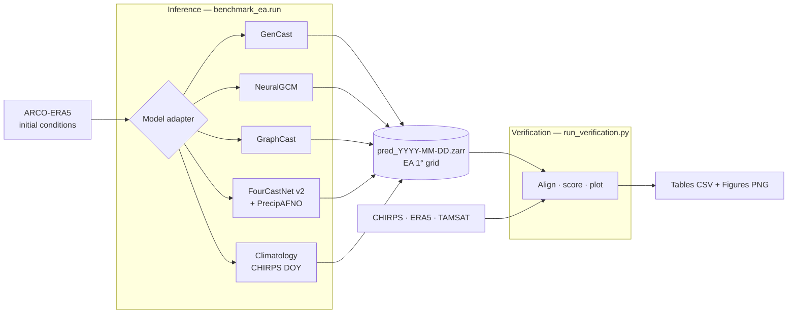

# Pipeline

The benchmark is a single reproducible pipeline built on xarray, Zarr, xESMF and
the properscoring/scores libraries. It has two decoupled stages — **inference**
(produce forecasts) and **verification** (score and plot them) — sharing one
canonical on-disk format.



## Canonical forecast format

Every model — deterministic or ensemble — writes **one Zarr store per
initialization date** in an identical layout, so verification code is the same
for all of them:

```
total_precipitation : float32  (init_time, sample, lead_day, lat, lon)   mm day⁻¹
```

Deterministic models (GraphCast, FourCastNet) are stored as single-member
ensembles (`sample = 1`), so their probabilistic scores reduce to the correct
deterministic limits (e.g. CRPS → MAE). Precipitation is regridded and subset to
the common **1° East Africa grid** before saving.

## Single inference entry point

All inference is driven by one configurable command, `benchmark_ea.run`
(wrapped by `run_inference.sh`, which activates the conda environment):

```bash
# Precipitation only (default), all models, full window
./run_inference.sh --models gencast graphcast fourcastnet climatology \
    --start 2024-03-01 --end 2024-05-31 --lead-days 1 3 5 7
```

Key flags: `--models · --start · --end · --lead-days · --n-members ·
--output-dir · --overwrite`. Each initialization is written to its own file, so
runs are **resumable** (complete files are skipped) and reproducible.

### Saving all variables

The same runner can persist **every model variable** (not just rainfall),
regridded to the EA grid, with a configurable ensemble scope:

| Flag | Effect |
|---|---|
| `--save-variables precip` | daily `total_precipitation` only (smallest) |
| `--save-variables all` | every model field, regridded/subset to the EA grid |
| `--extra-var-members mean` | non-precip fields stored as the ensemble mean (precip stays all-members) |
| `--extra-var-members all` | non-precip fields stored for every ensemble member (full fidelity) |

```bash
# Every variable, ensemble mean for non-precip fields (precip = all members)
./run_inference.sh --models gencast graphcast fourcastnet \
    --save-variables all --extra-var-members mean
```

A multi-GPU launcher, `run_inference_parallel.sh`, runs one model per GPU and
accepts the same options via environment variables
(`SAVE_VARIABLES`, `EXTRA_VAR_MEMBERS`, `OUTPUT_DIR`, …).

## Models

- **GenCast** (GenCast-Mini) — diffusion-based generative ensemble; a 10-member
  ensemble is drawn per initialization and native 12-hourly increments are
  summed to daily totals.
- **NeuralGCM** — hybrid dynamical-core + learned-physics model run as a
  10-member stochastic ensemble (runs in its own conda environment via
  `run_neuralgcm.sh`).
- **GraphCast** (GraphCast-small) — deterministic graph neural network run
  autoregressively at 1° with 13 pressure levels.
- **FourCastNet v2** — deterministic spherical-Fourier neural operator; it does
  not predict precipitation directly, so rainfall is obtained from the separate
  **PrecipitationAFNO** diagnostic. Both run through NVIDIA earth2mip.
- **Climatology** — the day-of-year distribution of CHIRPS over **2000–2020**, a
  21-member, strictly out-of-sample reference baseline.

## Verification

`run_verification.py` loads the prediction stores and the three observational
references, aligns each forecast with the observation valid at *init + lead*,
and computes the full metric catalogue (see **[Experimental
Setup](experimental-setup.md)**). One command writes every CSV table and every
figure shown in the Results section, each as vector PDF + 300-dpi PNG in a
shared publication style (colorblind-validated palette, defined once in
`benchmark_ea/verification/style.py`). Ensemble-only diagnostics — CRPS/spread,
rank histograms, reliability — automatically cover every model with more than
one member (GenCast, NeuralGCM). It reads only `total_precipitation`, so it
works identically on precip-only and all-variable prediction stores.

The climatology baseline, when present, is loaded automatically and used as the
reference for the **CRPS skill score** (CRPSS).
