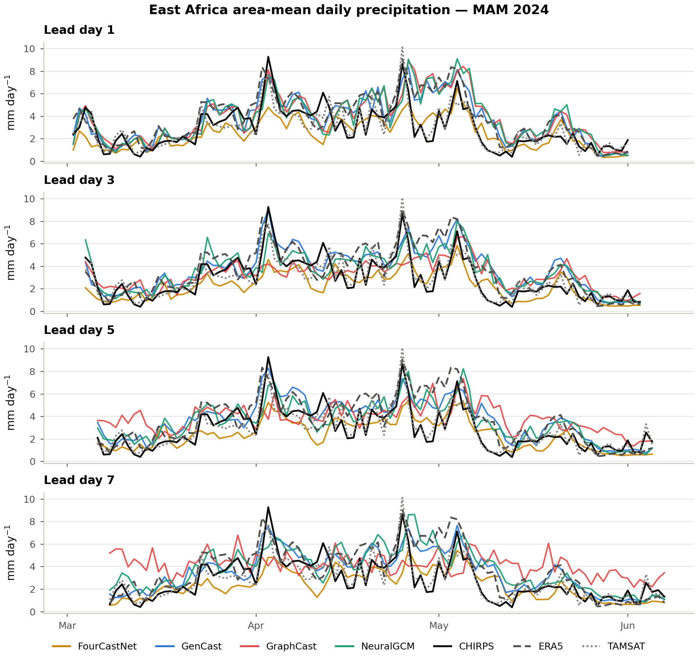
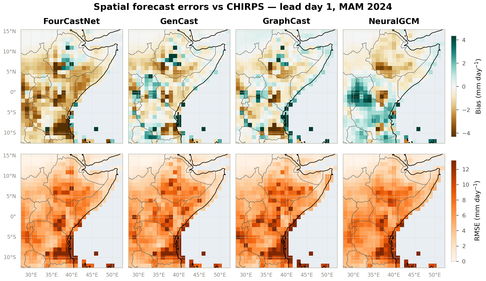
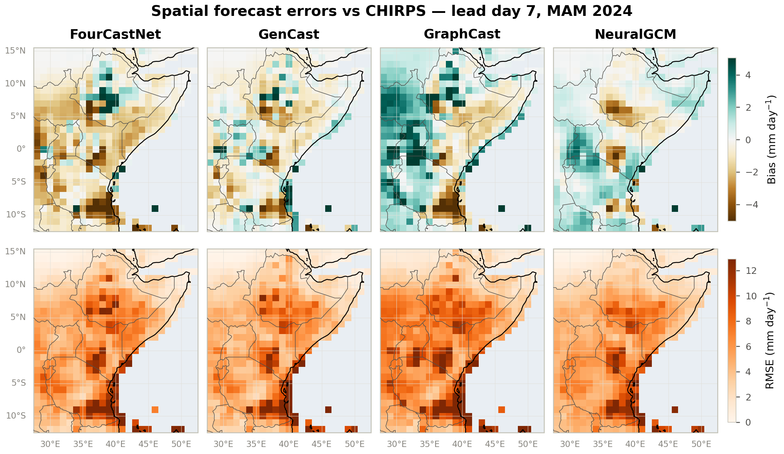
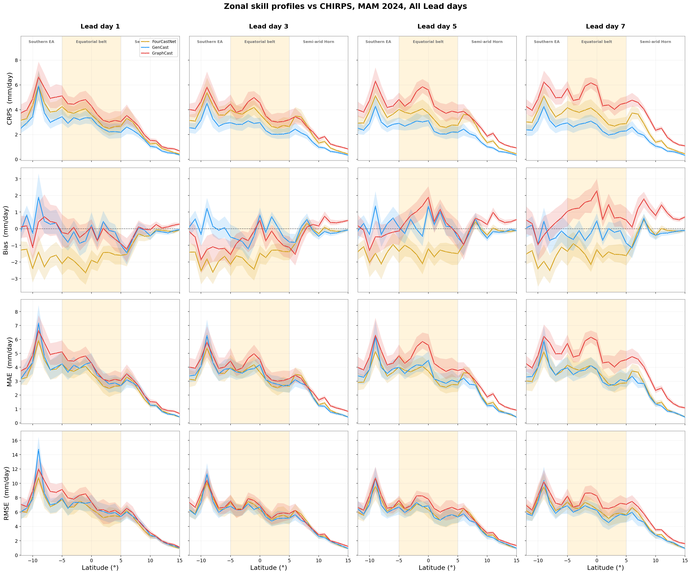

# Deterministic Skill

How accurately do the forecasts reproduce daily rainfall amounts, how do their
biases differ, and where in space do the errors concentrate?

## Domain-mean time series

{ loading=lazy }

Area-weighted, land-only **mean daily rainfall** over the domain across the
season, one panel per lead day, with the four forecasts (FourCastNet, GenCast,
GraphCast, NeuralGCM) overlaid on all three references (CHIRPS, ERA5, TAMSAT).

- The seasonal pulses — the early-April and late-April/early-May wet spells of
  MAM 2024 — are captured by all models at **lead day 1**, with GenCast and ERA5
  tracking the CHIRPS peaks most closely.
- **FourCastNet (gold) sits persistently below** the observations: it
  under-forecasts the domain-mean rainfall at every lead.
- As lead time grows the forecasts **damp the day-to-day variability**, and
  **GraphCast (red) increasingly over-predicts** — by lead day 7 it stays well
  above CHIRPS through the drier second half of the season.
- The three references themselves diverge by up to ~2 mm day⁻¹ on peak days
  (ERA5 tends highest), a direct view of observational uncertainty.

## Temporal error structure

{ loading=lazy }

Seven-day rolling **bias** (top) and **mean absolute error** (bottom) versus
valid date, one column per lead day, against CHIRPS.

- **Bias signatures are distinct and stable:** FourCastNet (gold) is negative
  throughout (~ −1 to −2 mm day⁻¹); GenCast (blue) hugs zero; GraphCast (red)
  drifts **increasingly positive with lead**, reaching +2 to +3 mm day⁻¹ early
  in the season at lead day 7.
- **MAE is driven by the wet episodes:** all models peak at ~5–6 mm day⁻¹ during
  the April rains and fall to ~1–2 mm day⁻¹ in dry spells. GraphCast carries the
  largest MAE at every lead; GenCast and FourCastNet track each other closely
  and lower.

## Spatial error maps

=== "Lead day 1"
    { loading=lazy }

=== "Lead day 3"
    { loading=lazy }

=== "Lead day 5"
    { loading=lazy }

=== "Lead day 7"
    { loading=lazy }

Per-cell **bias** (top, red = wet / blue = dry) and **RMSE** (bottom) against
CHIRPS, by model. Ocean cells are masked with a Natural Earth land mask
(independent of the obs product's own coverage, so this is consistent whether
the reference is CHIRPS or ERA5).

!!! note "Analysis below predates NeuralGCM"
    The bullets describe the original three-model comparison; NeuralGCM is
    now in the figure but not yet discussed here.

- Errors are **organized by terrain and coastline**, not latitude alone: the
  largest RMSE sits over the **Ethiopian highlands (~5–10°N)**, the
  Lake Victoria / western-rift zone, and the coastal strip — the wettest,
  most convective regions.
- FourCastNet's dry bias is **spatially coherent** (broad blue) over the
  highlands and equatorial belt; GenCast's bias is patchier and closer to zero;
  GraphCast shows scattered wet coastal cells.
- Comparing the tabs, **RMSE grows from lead 1 to lead 7** and the error
  patterns broaden, but their geography is largely preserved.

## Zonal profiles

{ loading=lazy }

CRPS, bias, MAE and RMSE as **profiles versus latitude** (south → north), one
column per lead day, with the three zonal bands shaded — Southern EA, the
**Equatorial belt** (5°S–5°N, highlighted), and the Semi-arid Horn.

- All error metrics **peak near 9°S** (the southern highlands) and through the
  equatorial belt, then **decay sharply toward the arid north**, where there is
  simply less rain to get wrong.
- **GenCast (blue) has the lowest CRPS** at essentially every latitude and lead.
- The **bias row** makes the model signatures explicit: FourCastNet (gold) is
  uniformly dry; GraphCast (red) develops a growing wet bias across the southern
  and equatorial bands as lead increases; GenCast stays near zero.

## Anomaly correlation

{ loading=lazy }

**Anomaly correlation coefficient (ACC)** versus lead day against CHIRPS and
TAMSAT, with the conventional **ACC = 0.6 "useful-skill" guide** marked.

!!! note "Analysis below predates NeuralGCM"
    The bullets describe the original three-model comparison; NeuralGCM is now
    in the figure but not yet discussed here.

- **No model reaches 0.6 at any lead** — daily rainfall anomalies over this
  convection-dominated region are intrinsically hard to predict.
- **GenCast is consistently highest** (≈ 0.36–0.41) and remarkably flat with
  lead. FourCastNet is intermediate (≈ 0.25–0.32); **GraphCast degrades fastest**,
  from ≈ 0.28 at lead 1 to ≈ 0.09 at lead 7.
