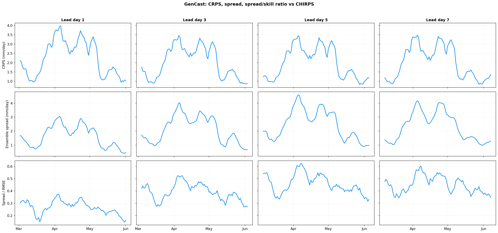
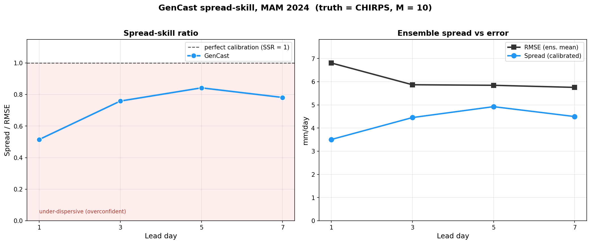
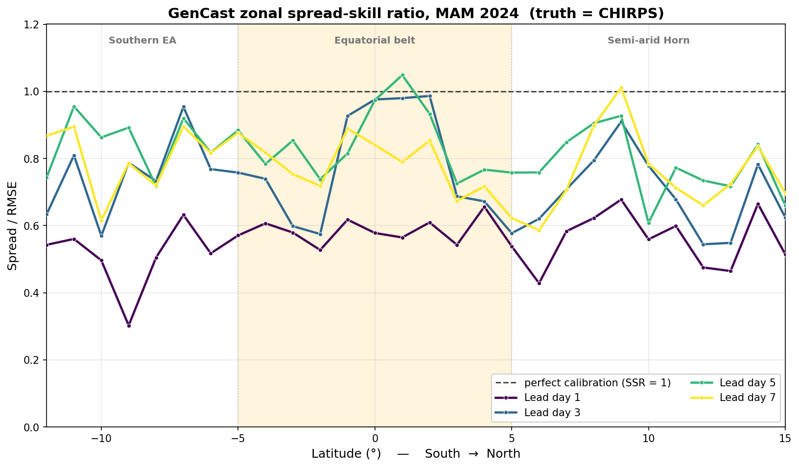
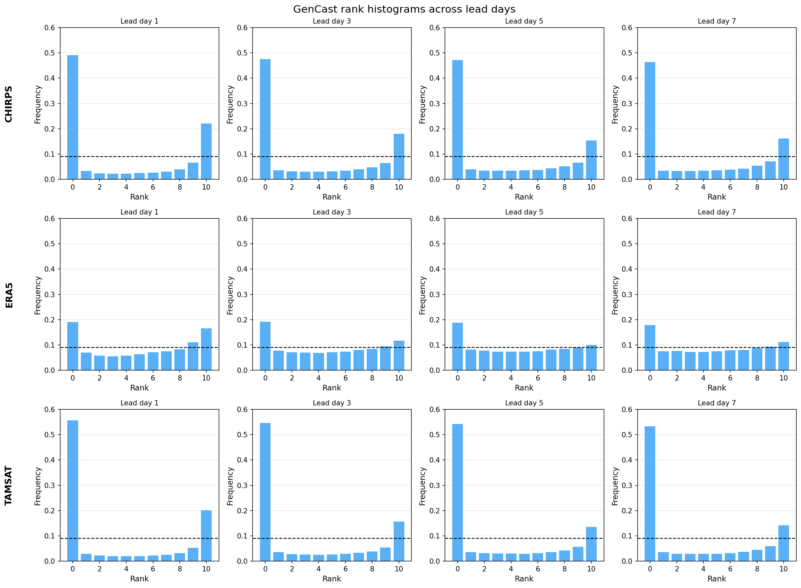
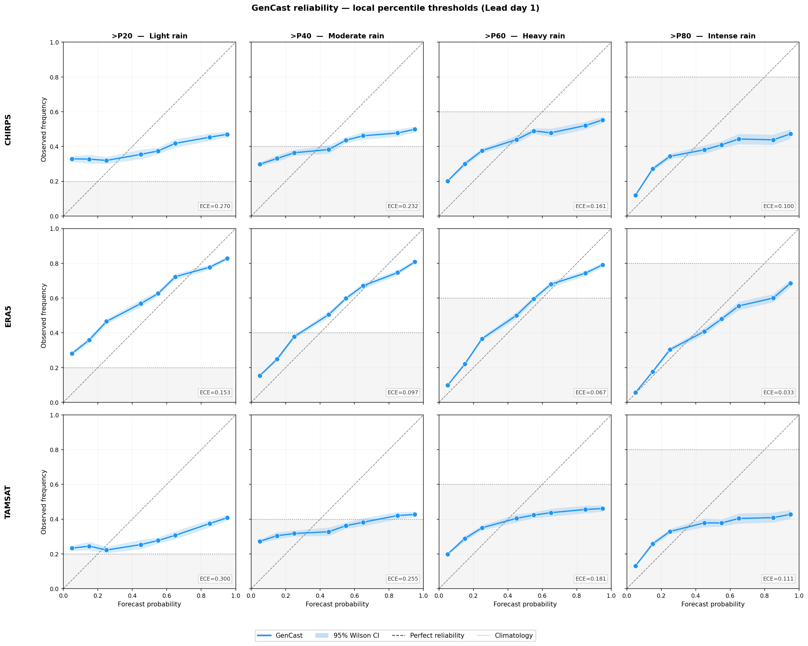

# Probabilistic Calibration

GenCast is the only ensemble system here, so the probabilistic analysis focuses
on it: is its forecast **uncertainty trustworthy**? (The deterministic models
reduce to single-member ensembles, for which CRPS equals MAE.)

## CRPS, spread and spread–skill over time

{ loading=lazy }

Daily **CRPS** (top), **ensemble spread** (middle) and the **spread ÷ RMSE
ratio** (bottom) for GenCast vs CHIRPS, one column per lead day.

- **CRPS tracks the rainfall regime** — rising to ~3.5–4 mm day⁻¹ during the
  April wet spells and falling to ~1 mm day⁻¹ in dry periods — but its
  season-mean is **remarkably stable across lead time** (~2.0–2.25 mm day⁻¹).
- **Ensemble spread grows with lead** (the model correctly becomes less certain
  further out), and the **spread/RMSE ratio rises with lead** — the ensemble is
  most overconfident at short range and becomes better calibrated by day 5–7.

## Spread–skill ratio

{ loading=lazy }

Left: the **spread–skill ratio (SSR = ensemble spread / ensemble-mean RMSE)**
versus lead, with the under-dispersive region (SSR < 1) shaded. Right: the two
ingredients — ensemble-mean RMSE and (calibrated) spread — separately.

- The SSR is **below 1 at every lead**: GenCast is **under-dispersive
  (overconfident)** — its ensemble is too narrow for its error.
- It **improves with lead**, rising from ~0.5 at day 1 toward ~0.8 by days 5–7,
  because (right panel) the **spread grows while RMSE slightly shrinks** as the
  ensemble mean smooths. The gap never closes — a well-calibrated ensemble would
  sit on the dashed SSR = 1 line.

### Where is it under-dispersive?

{ loading=lazy }

The same ratio resolved **by latitude**, one line per lead day, with the three
zonal bands shaded.

- Under-dispersion is **worst in the Southern EA band and at short lead** (purple
  day-1 line near 0.5–0.6).
- The ensemble is **closest to calibrated in the equatorial belt at longer
  leads**, where the day-5/7 lines approach (and locally touch) SSR = 1 — the
  active convective zone is where GenCast's spread is most realistic.

## Rank histograms

{ loading=lazy }

**Talagrand (verification-rank) histograms** for the 10-member GenCast ensemble,
one row per reference, one column per lead day. A calibrated ensemble is flat
(dashed line); the shape diagnoses miscalibration.

- Against **CHIRPS and TAMSAT** the histograms are sharply **U-shaped with a
  dominant left spike** (rank 0 ≈ 0.47–0.55 vs a flat value of ~0.09): the
  observation very often falls **outside the ensemble**, confirming
  under-dispersion. The large rank-0 bin reflects the many dry observed days that
  fall below an ensemble carrying non-zero rain.
- Against **ERA5 the histograms are far flatter** (rank 0 ≈ 0.19): GenCast's
  precipitation distribution is much closer to ERA5 than to the gauge–satellite
  products — calibration is **strongly observation-dependent**.

## Reliability diagrams

{ loading=lazy }

**Reliability** of GenCast's exceedance probabilities at grid-cell-local
percentile thresholds — P20 (light) → P80 (intense rain) — one row per reference,
with 95 % Wilson intervals and the per-panel **expected calibration error (ECE)**.

- Against **CHIRPS and TAMSAT** the curves lie **below the diagonal at high
  forecast probability**: when GenCast is confident it rains, it over-states the
  chance — the overconfidence seen in the rank histograms.
- **Calibration improves for more intense rain**: ECE falls from ~0.27 (light)
  to ~0.10 (intense) against CHIRPS — heavy-rain probabilities are the most
  trustworthy.
- Against **ERA5 the curves track the diagonal closely** (ECE ~0.15 → 0.03),
  again the best-calibrated reference — reinforcing that observational choice
  materially affects the verdict on calibration.
