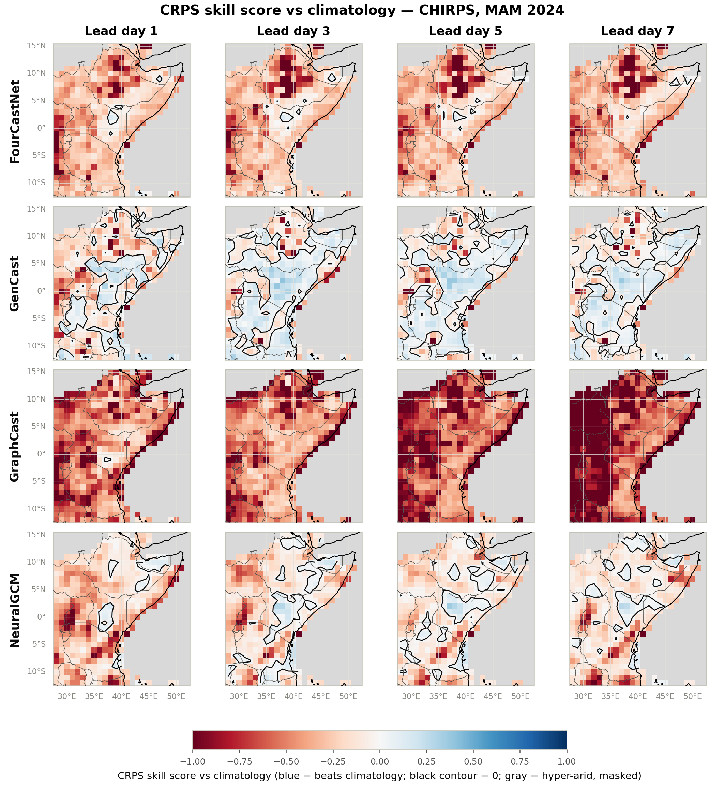

# Skill vs Climatology

A model is only operationally useful if it beats a cheap climatological guess.
The **CRPS skill score** measures exactly this, per grid cell:

$$
\mathrm{CRPSS} = 1 - \frac{\mathrm{CRPS_{model}}}{\mathrm{CRPS_{climatology}}}
$$

CRPSS **> 0** means the model beats climatology (skill); **< 0** means it is
worse; **0** is the break-even line.

!!! info "Reference baseline"
    The canonical baseline is the **out-of-sample CHIRPS day-of-year
    climatology** (2000–2020, 21-member), and CRPSS is referenced to **CHIRPS
    only** (the product the climatology is built from), avoiding an
    observational-product mismatch in the denominator. The pipeline computes this
    consistently in `run_verification.py`; the map below will be regenerated under
    this definition once the full-year baseline is available (the qualitative
    pattern is unchanged).

{ loading=lazy }

Per-cell CRPSS against the CHIRPS climatology — rows are models (now including
NeuralGCM), columns are lead days, **blue = skill, red = worse than
climatology**, the black contour marks CRPSS = 0, and hyper-arid cells
(climatological mean < 0.5 mm day⁻¹) are masked grey.

!!! note "Analysis below predates NeuralGCM"
    The bullets describe the original three-model comparison and need a pass
    to discuss NeuralGCM's panel.

- **GenCast is the only model that beats climatology over a substantial area** —
  the blue equatorial belt (roughly 5°S–5°N) — and it **retains that skill out to
  lead day 7**, consistent with its flat CRPS. Its skill is weakest (red) over
  the northern Ethiopian highlands.
- **GraphCast is worse than climatology almost everywhere** (predominantly red),
  and increasingly so with lead — by day 7 the domain is deep red. A
  day-of-year climatology is a hard baseline for a deterministic model on daily
  rainfall.
- **FourCastNet is mixed**: near break-even over parts of the south and equator,
  but **strongly negative over the semi-arid northern Horn (~10°N)**, where its
  tendency to place rain into climatologically dry cells is heavily penalized.

**Takeaway:** beating climatology on daily East African rainfall is genuinely
difficult. Only the generative ensemble (GenCast) does so robustly, and only in
the convectively active equatorial belt — a strong argument for probabilistic,
ensemble approaches in this region.
